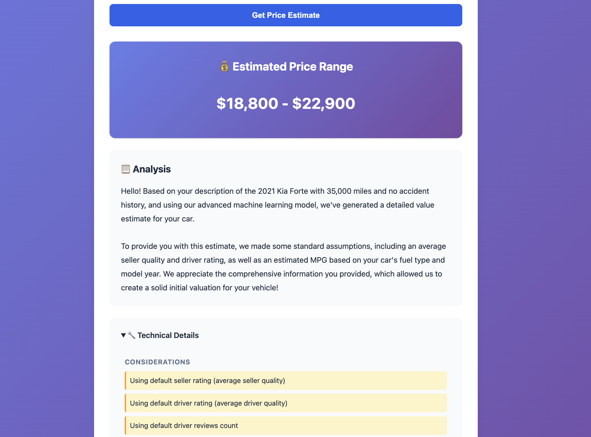

# Used Cars Price Prediction with LLM Integration

ML application that predicts used car prices from natural language descriptions using XGBoost and Google Gemini models.

## What's Built

### Phase 1: Project Structure ✅
- Constants and metadata (`backend/app/constants.py`)
- Feature definitions and default values
- MPG estimation logic

### Phase 2: LLM Integration ✅
- Natural language feature extraction (`backend/app/services/llm_service.py`)
- Google Gemini API integration (configurable model selection)
- Structured prompt engineering with few-shot learning
- Automatic default filling for missing features

### Phase 3: Model Service & Validation ✅
- Model pipeline loading with joblib (`backend/app/services/model_service.py`)
- Price prediction with confidence intervals
- Pydantic validation (`backend/app/services/validation.py`)
- User-friendly warning generation

### Phase 4: FastAPI Backend ✅
- FastAPI application with CORS support (`backend/app/main.py`)
- REST API endpoints (`backend/app/api/endpoints.py`)
  - `POST /api/v1/predict` - Price prediction from natural language
  - `GET /api/v1/health` - Health check endpoint
- Request/response schemas (`backend/app/schemas/api_schemas.py`)
- Service initialization at startup (singleton pattern)
- Error handling and logging
- LLM-generated friendly summaries

### Phase 5: Web Frontend ✅
- Clean, modern HTML/CSS/JS interface (`frontend/`)
- Single-page application served by FastAPI
- Real-time price predictions
- AI-generated user-friendly explanations
- Responsive design for mobile and desktop
- No external frontend framework dependencies

### Testing
- Feature extraction test suite (`tests/test_llm_extraction.py`)
  - 15 test examples covering various scenarios
  - Results saved to timestamped files
- API endpoint tests (`tests/test_api.py`)
  - Health check validation
  - Prediction endpoint testing
  - Error handling verification

## User Interface

### Main Interface
The application features a clean, modern web interface where users can describe their car in natural language:


### Prediction Results
After submission, the app displays the estimated price range along with an AI-generated explanation:



## Configuration

The application uses a centralized configuration system (`backend/app/config.py`) that allows easy customization via environment variables.

### Available Settings

| Setting | Default | Description |
|---------|---------|-------------|
| `GEMINI_API_KEY` | *(required)* | Google Gemini API key |
| `GEMINI_MODEL_NAME` | `gemini-2.5-flash` | Gemini model to use (see [available models](https://ai.google.dev/gemini-api/docs/models/gemini)) |
| `RATE_LIMIT_PER_DAY` | `30` | Maximum API requests per day |
| `LLM_MAX_RETRIES` | `3` | Retry attempts for LLM API calls |

### How to Override

**Local (.env file):**
```bash
cp .env.example .env
# Edit .env:
GEMINI_API_KEY=your_key_here
GEMINI_MODEL_NAME=gemini-1.5-pro  # Optional: use a different model
RATE_LIMIT_PER_DAY=100             # Optional: increase rate limit
```

**Production (Fly.io):**
```bash
fly secrets set GEMINI_MODEL_NAME=gemini-1.5-pro
fly secrets set RATE_LIMIT_PER_DAY=100
```

Changes via `fly secrets set` take effect immediately (no rebuild needed).

---

## Setup

### Option 1: Docker (Recommended for Quick Start)

1. **Set up API key** (choose one method):

   **Method A - Using system environment variable (simplest):**
   ```bash
   export GEMINI_API_KEY=your_api_key_here
   ```

   **Method B - Using .env file (recommended):**
   ```bash
   cp .env.example .env
   # Edit .env and add your GEMINI_API_KEY
   # Optionally customize: GEMINI_MODEL_NAME, RATE_LIMIT_PER_DAY, etc.
   ```

2. **Build and run:**
   ```bash
   docker compose build
   docker compose up -d
   ```

3. **Access the application:**
   - **Web Interface**: http://localhost:8000
   - API Documentation: http://localhost:8000/docs
   - Health Check: http://localhost:8000/api/v1/health

4. **View logs:**
   ```bash
   docker compose logs -f
   # Press Ctrl+C to exit logs (container keeps running)
   ```

5. **Stop the application:**
   ```bash
   docker compose down
   ```

### Option 2: Local Development

1. **Install dependencies:**
   ```bash
   uv sync
   ```

2. **Set up environment variables:**
   ```bash
   # Option 1: Export directly
   export GEMINI_API_KEY=your_api_key_here

   # Option 2: Use .env file (recommended)
   cp .env.example .env
   # Edit .env to add your GEMINI_API_KEY
   # Optionally customize model and rate limits
   ```

3. **Run the application:**
   ```bash
   uvicorn backend.app.main:app --reload
   ```

4. **Access the application:**
   - **Web Interface**: http://localhost:8000
   - API Documentation: http://localhost:8000/docs
   - Health Check: http://localhost:8000/api/v1/health

5. **Run tests:**
   ```bash
   # Test LLM feature extraction
   python tests/test_llm_extraction.py

   # Test API endpoints (server must be running)
   python tests/test_api.py
   ```

## How It Works

1. User provides natural language car description via web interface
2. LLM extracts structured features (manufacturer, year, mileage, etc.)
3. Missing features filled with defaults
4. Features validated with Pydantic
5. ML model predicts price with confidence interval
6. LLM generates friendly summary explaining the estimate and considerations
7. Results displayed with price range and AI-generated explanation

## Docker Architecture

### Why Docker?
- ✅ **Reproducible builds**: Exact dependency versions locked via `uv.lock`
- ✅ **Single command deployment**: `docker-compose up` and you're running
- ✅ **Future-ready**: Easy to add Redis, PostgreSQL, Nginx when needed
- ✅ **Production-ready**: Non-root user, health checks, restart policies

### Technical Details

**Multi-stage build:**
1. **Stage 1 (builder)**: Uses `uv` to install exact locked dependencies
2. **Stage 2 (runtime)**: Copies only necessary files to slim Python image

**Security:**
- Runs as non-root user (`appuser`)
- Minimal attack surface (slim base image)
- Health check endpoint monitoring

**Flexibility:**
- Supports both `.env` file and system environment variables
- Environment variables take precedence (12-factor app pattern)

**Future services** (commented in `docker-compose.yml`):
- Redis for caching predictions
- PostgreSQL for analytics/request logging
- Nginx for reverse proxy + rate limiting

### Docker Commands Reference

```bash
# Build and start
docker compose up -d

# Rebuild after code changes
docker compose up -d --build

# View logs (Ctrl+C to exit, container keeps running)
docker compose logs -f app

# Check running containers
docker compose ps

# Stop
docker compose down

# Stop and remove volumes
docker compose down -v

# Check health
curl http://localhost:8000/api/v1/health
```

## Using the Application

### Web Interface (Recommended)
The easiest way to use the application:

1. Start the server: `uvicorn backend.app.main:app --reload`
2. Open http://localhost:8000 in your browser
3. Enter your car description in the text area
4. Click "Get Price Estimate"
5. View the estimated price range and AI-generated explanation

### API Testing (Swagger UI)
You can also test the API directly using the built-in Swagger UI:

1. Start the server: `uvicorn backend.app.main:app --reload`
2. Open http://localhost:8000/docs in your browser
3. Click on `POST /api/v1/predict`
4. Click **"Try it out"**
5. Enter your request and click **"Execute"**

### Request Format
All requests must include the `"description"` key:

```json
{
  "description": "2020 Toyota Camry, 45k miles, automatic, clean title"
}
```

### Response Format
```json
{
  "price": 25000,
  "price_min": 22500,
  "price_max": 27500,
  "confidence": 0.9,
  "warnings": [
    "Using default seller rating (average seller quality)",
    "Using default driver rating (average driver quality)"
  ],
  "friendly_summary": "Hello! Using the information you provided and our machine learning model, we've estimated the current market value.\n\nFor this estimate, our analysis used some default assumptions for factors like seller and driver quality..."
}
```

### Example Descriptions
- `"2020 Toyota Camry, 45k miles, automatic transmission, one owner, no accidents"`
- `"Used Honda Civic 2018"`
- `"Ford F-150 2021, 4x4, automatic, 30k miles, gray interior"`
- `"2020 Toyota Prius hybrid, 40k miles, CVT, 55 mpg, no accidents"`

## Next Steps

- [x] FastAPI backend with REST endpoints
- [x] Web frontend interface
- [x] Docker deployment setup
- [x] Rate limiting (30 requests/day to protect against LLM API costs)
- [x] Fly.io deployment configuration (ready to deploy)
- [x] Deploy to Fly.io (run `fly launch`)
- [ ] GitHub Actions CI/CD pipeline (automatic deployment)

## Deployment to Fly.io (Free Tier)

### Quick Start Deployment

**Time estimate**: ~10 minutes

The project includes a pre-configured `fly.toml` file optimized for the **Fly.io free tier** with:
- ✅ Auto-stop/start machines (scale to zero when idle)
- ✅ Health checks configured
- ✅ 256MB RAM, 1 shared CPU (fits in free tier)
- ✅ HTTPS enabled

**Steps**:

1. **Install Fly.io CLI** (if not installed):
   ```bash
   # macOS
   brew install flyctl

   # Linux/WSL
   curl -L https://fly.io/install.sh | sh
   ```

2. **Login to Fly.io**:
   ```bash
   fly auth login
   ```

3. **Launch the app** (first time only):
   ```bash
   fly launch
   # This will:
   # - Read the existing fly.toml configuration
   # - Prompt for app name (or use auto-generated)
   # - Prompt for region (choose closest to you: ord=Chicago, iad=Virginia, lax=LA)
   # - Ask about PostgreSQL (No)
   # - Ask about Redis (No)
   # - Ask to deploy now (Yes)
   ```

4. **Set your API key as a secret**:
   ```bash
   fly secrets set GEMINI_API_KEY=your_actual_api_key_here
   ```

5. **Deploy** (after initial launch or for updates):
   ```bash
   fly deploy
   ```

6. **Open your deployed app**:
   ```bash
   fly open
   # Or visit: https://your-app-name.fly.dev
   ```

**Monitoring**:
```bash
fly logs              # View real-time logs
fly status            # Check app status
fly dashboard         # Open web dashboard
```

---

### Phase 2: GitHub Actions CI/CD (Professional Workflow)

**Goal**: Automatic deployment on every push to `main` branch.

**Time estimate**: ~45 minutes

**Benefits**:
- ✅ Automatic deployment (push to GitHub = deployed)
- ✅ Portfolio enhancement: "Implemented CI/CD pipeline with GitHub Actions"
- ✅ Professional workflow
- ✅ Can add automated testing
- ✅ Valuable DevOps skill

**Steps**:

1. **Get Fly.io API token**:
   ```bash
   fly auth token
   # Copy the token that appears
   ```

2. **Add token to GitHub repository secrets**:
   - Go to your GitHub repo
   - Settings → Secrets and variables → Actions
   - Click "New repository secret"
   - Name: `FLY_API_TOKEN`
   - Value: (paste the token from step 1)
   - Click "Add secret"

3. **Create `.github/workflows/deploy.yml`**:
   ```yaml
   name: Deploy to Fly.io

   on:
     push:
       branches:
         - main

   jobs:
     deploy:
       name: Deploy to Fly.io
       runs-on: ubuntu-latest

       steps:
         - name: Checkout code
           uses: actions/checkout@v4

         - name: Set up Fly.io CLI
           uses: superfly/flyctl-actions/setup-flyctl@master

         - name: Deploy to Fly.io
           run: flyctl deploy --remote-only
           env:
             FLY_API_TOKEN: ${{ secrets.FLY_API_TOKEN }}
   ```

4. **Commit and push**:
   ```bash
   git add .github/workflows/deploy.yml
   git commit -m "Add GitHub Actions CI/CD pipeline for Fly.io deployment"
   git push origin main
   ```

5. **Watch the deployment**:
   - Go to GitHub repo → Actions tab
   - You'll see the workflow running
   - Green checkmark = deployed successfully!

**Optional enhancements** (add later):
- Run tests before deployment
- Deploy to staging environment first
- Slack/Discord notifications on deployment
- Deployment status badges in README

---

### Phase 3: Monitoring & Optimization (Post-Deployment)

**After deployment**:

1. **Monitor costs** (weekly for first month):
   - Fly.io dashboard → Usage/Cost Explorer
   - Should stay at $0.00 with your traffic
   - Rate limiter protects against LLM API overuse

2. **Monitor rate limiter**:
   - Check logs for "Rate limit exceeded" messages
   - Adjust limit if needed (currently 30/day)

3. **Set up basic monitoring**:
   - Fly.io health checks (already configured)
   - Optional: Add error tracking (Sentry free tier)
   - Optional: Add analytics (Plausible, Simple Analytics)

**Estimated monthly costs** (for portfolio/demo use):
- **Fly.io**: **$0** (free tier includes: 3 shared-cpu-1x VMs @ 256MB RAM each - this app uses 1 VM @ 256MB)
- **Gemini API**: **$0** (free tier includes 15 requests/minute, 1,500 requests/day - our rate limiter caps at 30/day)
- **Total**: **$0/month** for portfolio use 🎉

> **Note**: With scale-to-zero configured, your app will:
> - Stop when inactive (saves resources)
> - Auto-start when someone visits (may take 3-5 seconds on first request)
> - Perfect for portfolio/demo purposes!

---

### Quick Reference Commands

```bash
# Fly.io deployment
fly deploy                    # Deploy latest code
fly logs                      # View logs
fly status                    # Check app status
fly open                      # Open app in browser
fly ssh console               # SSH into container (debugging)
fly apps destroy APP_NAME     # Delete app (stop all charges)

# Cost monitoring
fly apps list                 # See all apps
# Then check Fly.io dashboard → Cost Explorer

# Local development
uvicorn backend.app.main:app --reload    # Run locally with hot reload
docker compose up -d                      # Test Docker build locally
docker compose logs -f                    # View local Docker logs
```
